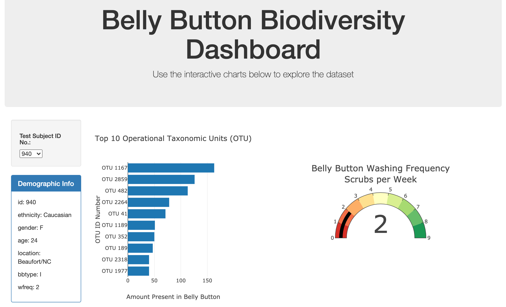
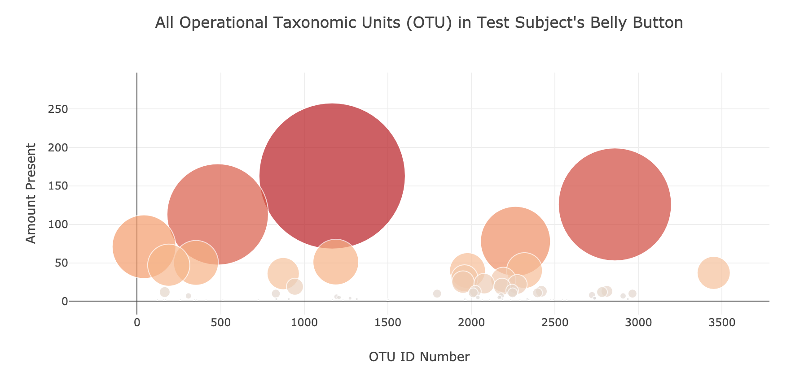

### Purpose of analysis:
The purpose of this project is to create a single HTML dashboard where users can select different test subjects from a dropdown list to see various charts displaying data on that subject's belly betton. This was created using Javascript, D3.js, Plotly, HTML, CSS, and Bootstrap.

### How to run the code:
**First Option**
1. Save all files of repository (except the files in the screenshots folder) to a folder on your computer.
1. Open your terminal.
1. cd into the folder your saved the files in.
1. Run the command “python -m http.server”.
1. Copy the server listed in the response (ex. http://0.0.0.0:8000/)
1. Paste the server in your browser **OR** type "localhost:8000" in your browser.
1. Use the dropdown menu to view data on different test subjects.
<!-- end of the list -->
**Second Option:**
1. View page from Github Pages at: [https://sfroonjian.github.io/Plotly-Belly-Button-Biodiversity/](https://sfroonjian.github.io/Plotly-Belly-Button-Biodiversity/)

### Data collected:

### Why the data is displayed this way:
The data for each test subject is displayed in several different ways so the user can quickly and easily view various information about them:
* A list of the test subject's demographics to see their background
* A horizontal bar graph to see the top 10 most abundant microorganisms in the test subject's belly button
* A guage chart to see how many times per week the test subject washes their belly button
* A bubble chart to see the abundancce of all the microorganisms in the test subject's belly button
